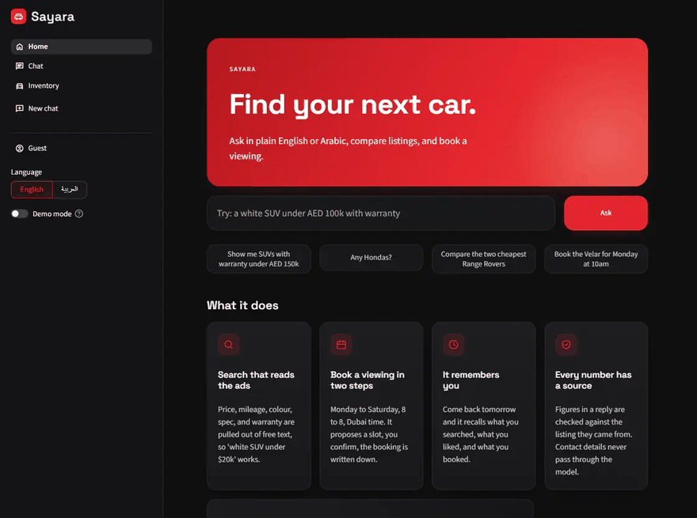
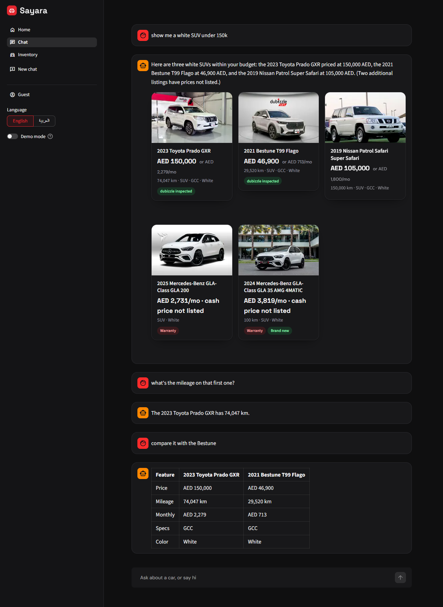
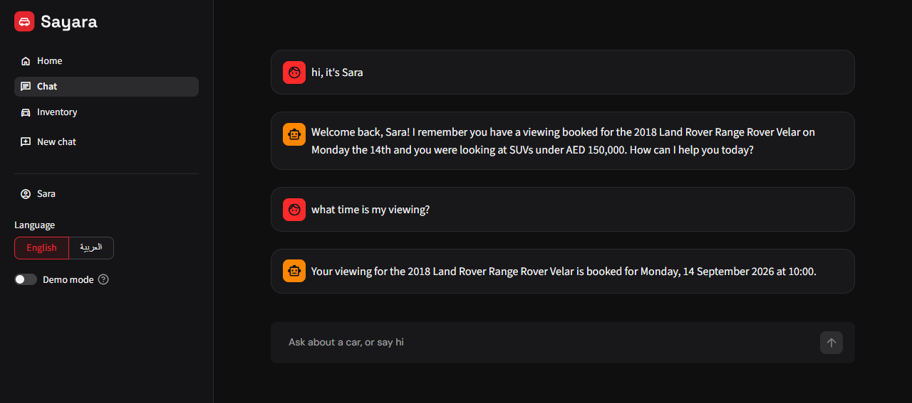

# Sayara

A chat assistant over 189 used-car listings. It searches the inventory, books viewings, and
writes qualified buyers to a lead sheet. FastAPI backend, Streamlit client, SQLite, Gemini
through LiteLLM.



Search, a follow-up that resolves "that first one", a comparison, a booking, recall in a new
session, a saved conversation reopened, Arabic, and the trace behind a reply. Recorded against
Gemini.

Longer notes on the data, retrieval, guardrails, and scale are in
[docs/DESIGN.md](docs/DESIGN.md).

## Setup

One command. It installs what it needs, and no API key is required.

| Platform | Run this |
|---|---|
| Windows | double-click `run.bat` |
| macOS, Linux | `./run.sh` |

It installs [uv](https://docs.astral.sh/uv/) if you do not have it, asking first, then fetches
the dependencies, starts the backend and the client, seeds a returning customer so the memory
demo works, and opens a browser. Ctrl+C stops both. Needs Python 3.11 to 3.13.

Until you add a key, replies come from a rule-based stand-in, and the home page says which one
is answering. To use Gemini, paste a key into the panel the home page offers, or run
`run.bat --set-key` or `./run.sh --set-key`. Either way the key is masked as you type, written
to `.env`, which is gitignored, and used from the next turn without a restart.

For a run that is identical every time, with no key and no network, replay the recorded demo.
It plays two scripted conversations from a cassette of 28 model calls.

```
LLM_CASSETTE_MODE=replay uv run uvicorn main:app
uv run python scripts/demo.py
```

Every other way to start it, and every flag, is in [docs/DESIGN.md](docs/DESIGN.md).

## Why these choices

Streamlit over a notebook, because the brief is a product prototype and a reviewer should be
able to type into it. The client is a thin HTTP layer with no state of its own, so swapping it
for a notebook would not touch the backend. No agent framework: the tool loop is one file I
own, and owning it is what makes the grounding check and the recorded demo possible. LiteLLM
sits between the loop and the model, so the same code runs on Gemini or on a local model
through LM Studio. Retrieval is RAG with SQL and full-text search instead of vectors, because
most of what buyers ask is a filter and a budget is a WHERE clause. Embeddings are built and
switchable but off. SQLite for memory because it is one file, needs no server, and has
full-text search built in. Leads go to CSV because the brief says CSV.

## Implementation

A message goes through regex guardrails before any model call, then a resolver turns phrases like "the
second one" or "the white one" into a listing id from the cars on screen, so the model never
guesses which car is meant. The model gets seven tools and up to six calls a turn. Search
applies structured filters first and relaxes them one at a time when nothing matches, saying
which it dropped. The reply comes back as JSON against a schema, and every number in it is
checked against that turn's tool results: a miss gets one retry, a second miss gets a template
built from the tool results. The dataset has no price, mileage, colour, or body column, so a
two-pass ingest pulls those out of the descriptions, regex first and then one batched model
pass, cached and committed so a rebuild costs nothing. Conversations are saved against the
user, so the sidebar lists past chats, any of them reopens, and each downloads as Markdown or
JSON.

Outside the scope of this prototype: authentication, because there is nothing local to verify
a token against, so today anyone who knows a user id can read that profile, and in production
one FastAPI dependency reading dubizzle's bearer token would fix it. Identity is a typed name
that a marketplace login would replace. Listing ids are sheet row numbers where production
would use dubizzle listing ids read from the listing feed, leads would post to a CRM endpoint
instead of a CSV, and the availability grid is where a seller's calendar would plug in. At
scale the first things to fix are identity, pruning the turn traces, widening the three-digit
id pattern, and making the chat route async.

## Screenshots

`docs/demo_transcript.json` is the terminal-log version of both scenarios.

**1. A multi-turn conversation exploring the inventory**



**2. The agent recalling a user's history in a completely new session**


